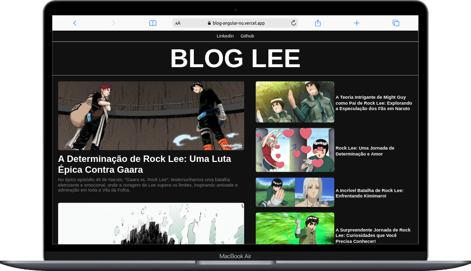

# BlogAngular

Este software é um blog criado com Angular baseado em um layout do site dribbble, além disso é uma homenagem ao personagem de Naruto, o Rook Lee.

##Deploy
acesse o app clicando [aqui](https://blog-angular-nu.vercel.app/)

    
  &nbsp;&nbsp;&nbsp;&nbsp;&nbsp;&nbsp;&nbsp;&nbsp;
    

    

